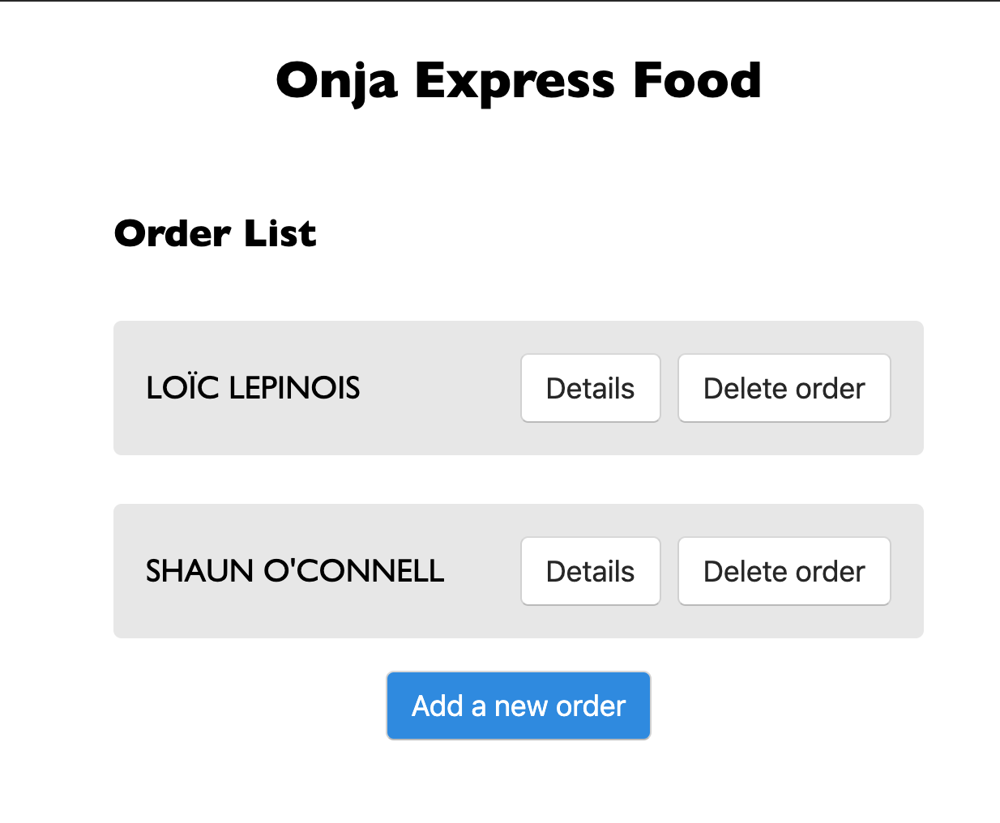
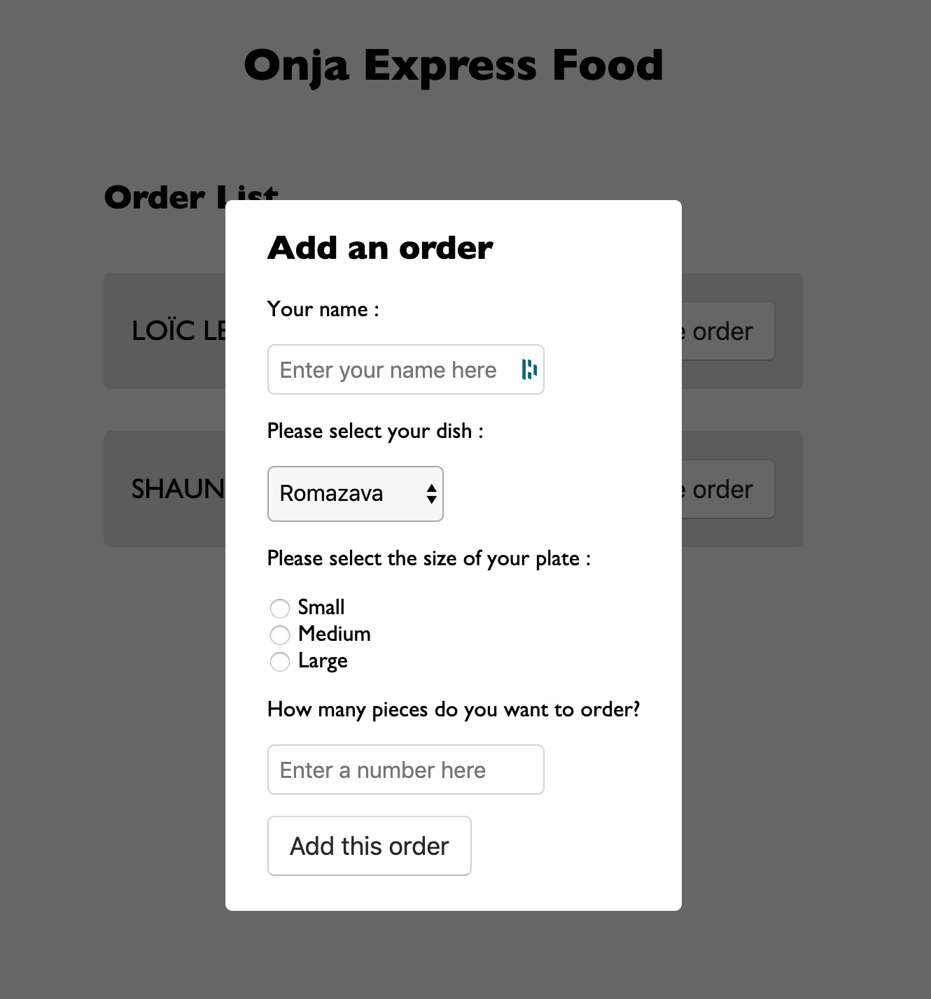
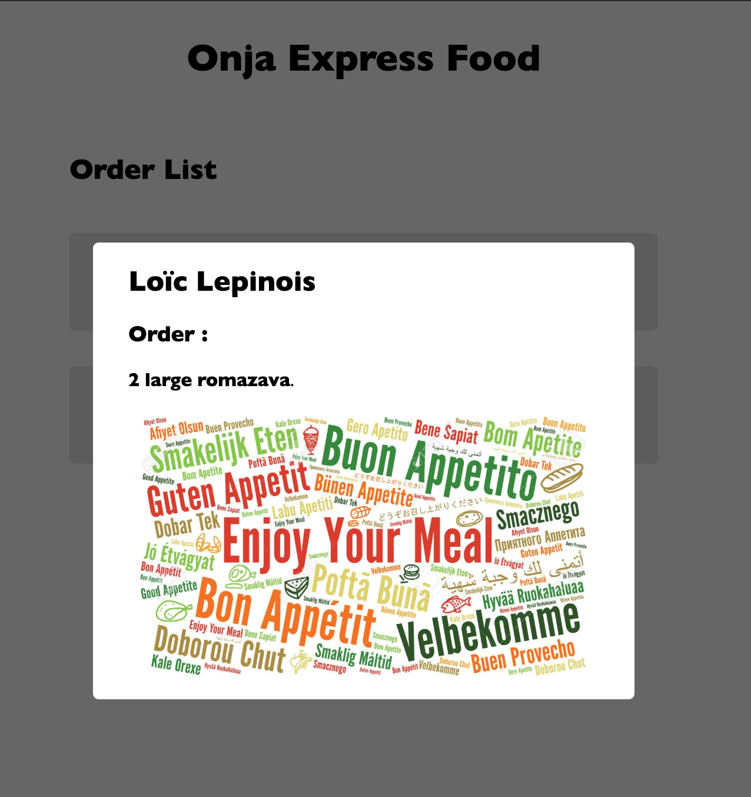

# WKP3 - Onja Express Food

Hello again!
So this saturday, I have the pleasure to announce you our new ONJA activity, we’re going into the restaurant business! 😎

We’ll use a website to keep track of all the food orders.



The main website feature will allow us to add an order, and then we’ll see all the order in the list.

When I click on “Add a new order” a modal will appear, with the form inside.



To complete an order, you’ll need to write your name, select the dish that you want, select the size of the portion, and the quantity of it.
All fields are required!

After completing the form, and submit the order, the order will should appear in the list.

When I click on detail button, the full order info should appear in the modal. You can change this style as you like, as long as you have the correct info in the modal.



Also, the delete button will delete the order, obviously.
I gave you some (not very good) css, but feel free to style anything you want. Also, you'll have to write the css for the modal yourself.
To save you some time, here's the html code for the form that will go into the modal.

```html
<form>
	<p>Your name :</p>
	<input
		class="input-form"
		type="text"
		id="name"
		name="name"
		placeholder="Enter your name here"
		required
	/>
	<p>Please select your dish :</p>
	<select name="dish" class="select-form" required>
		<option value="romazava">Romazava</option>
		<option value="koba">Koba</option>
		<option value="ravitoto">Ravitoto</option>
		<option value="mokary">Mokary</option>
		<option value="achard">Achard</option>
		<option value="masikita">Masikita</option>
		<option value="sambos">Sambos</option>
		<option value="mofo-baolina">Mofo baolina</option>
		<option value="ranonapango">Ranonapango</option>
	</select>
	<p>Please select the size of your plate :</p>
	<input type="radio" id="small" name="size" value="small" required />
	<label for="small">Small</label><br />
	<input type="radio" id="medium" name="size" value="medium" />
	<label for="medium">Medium</label><br />
	<input type="radio" id="large" name="size" value="large" />
	<label for="large">Large</label><br />
	<p>How many pieces do you want to order?</p>
	<input
		class="input-form"
		type="number"
		id="quantity"
		name="amount"
		placeholder="Enter a number here"
		required
	/>
	<button class="submitOrder" type="submit">Add this order</button>
</form>
```

## A little tip :

-   You will need to use the event delegation technique to listen on the form's submit event, as well as the detail button and delete order button.

So now, fork the project, clone your fork, and bon appétit!

🔥🔥🔥🔥🔥🔥🔥
